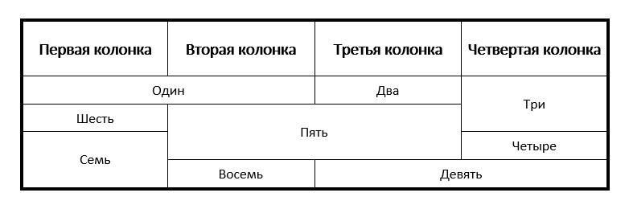

# Lesson 1

### Задание 1 - Git и терминал

1. Установить [Git](https://git-scm.com/downloads) на комп
2. Почитать, а лучше посмотреть видео о том, что такое `терминал / командная строка` и как с ними работать
3. Почитать / посмотреть, как использовать `Git Bash` вместо родной командной строки
4. Попытаться разобраться с [Git'ом](https://git-scm.com/downloads)
5. Клонировать репозиторий себе на компьютер (как клонировать узнаешь из предыдущего пункта)

---

### Задание 2 - Маргины-паддинги

См. картинку *[task.png](./task.png)*. Соответствующим блокам присвоены следующие стили:

```
.wrap {
  display: inline-block;
  width: 420px;
  background: white;
  margin: 0 auto;
  vertical-align: middle;
}

.green {
  margin: 10px;
  padding: 10px;
  background: #339933;
  border: 2px solid black;
}

.orange {
  background: #ff9900;
  border: 2px solid black;
}

.blue {
  background: #3399ff;
  border: 2px solid black;
  margin: 24px;
  padding: 15px;
}

.red {
  background: #ff3300;
  border: 2px solid black;
}
```

### Вопросы

1. Чему равна ширина блока с классом `red`?
2. Какую высоту и какому блоку нужно задать, чтобы высота блока с классом `wrap` была равна 618px?
3. Какой будет ширина остальных блоков, если ширину в 420px задать не блоку с классом `wrap`, блоку с классом `red`?

> Добавь необходимую HTML-разметку в файл ***marg-pad.html*** (соблюдай порядок вложенности!) и перечисленные выше стили в файл ***style.css***  - и можешь проверить себя (используй DevTools в браузере Google Chrome - клавиша <kbd>F12</kbd>).
---

### Задание 3 - Сверстать таблицу div'ами

