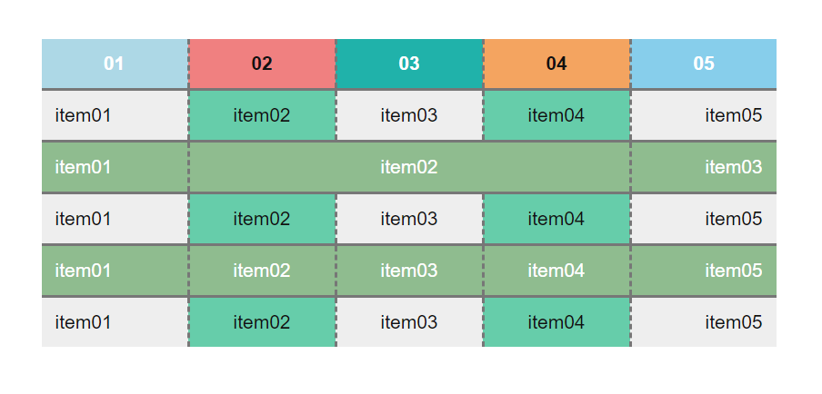

# Lesson 2

## Task 01

1. Сверстать таблицу. Цвета можешь использовать любые, НО:
- фон каждой ячейки в шапке не повторяется нигде
- цвет фона вторых и четвертых колонок - одинаковый, второй и четвертой строки - тоже
- все оставшиеся ячейки - с серым фоном
- выравнивание текста в ячейках - как на картинке
- отступы кратны 5 пикселям

> Можешь скачать расширение для Chrome [PixelPerfect](https://chrome.google.com/webstore/detail/perfectpixel-by-welldonec/dkaagdgjmgdmbnecmcefdhjekcoceebi) для наложения верстки на картинку, чтобы было как в HtmlAcademy.